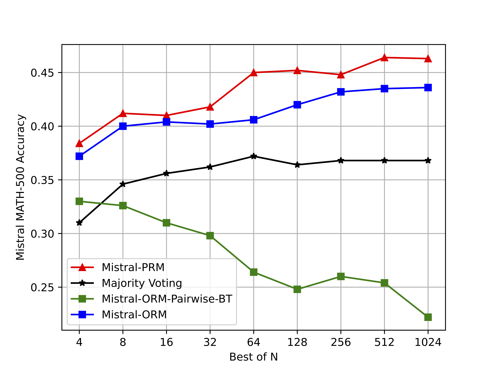
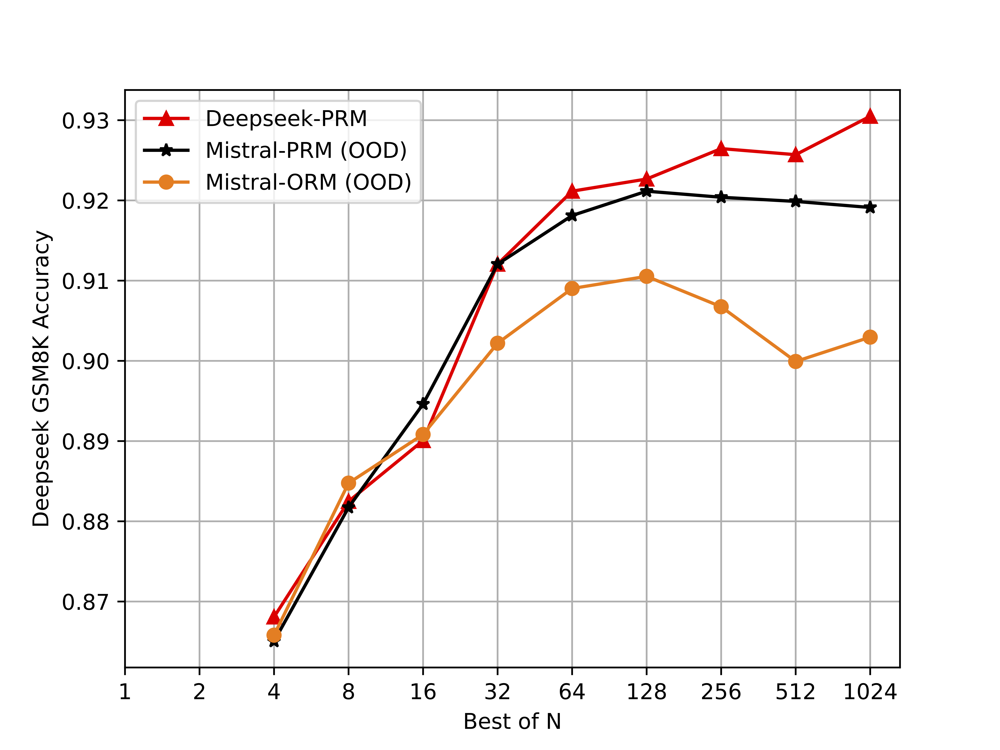

# RLHF-Reward-Modeling: Math Reward

Model
- [RLHFlow/Llama3.1-8B-PRM-Mistral-Data](https://huggingface.co/RLHFlow/Llama3.1-8B-PRM-Mistral-Data)
- [RLHFlow/Llama3.1-8B-ORM-Mistral-Data](https://huggingface.co/RLHFlow/Llama3.1-8B-ORM-Mistral-Data)
- [RLHFlow/Llama3.1-8B-PRM-Deepseek-Data](https://huggingface.co/RLHFlow/Llama3.1-8B-PRM-Deepseek-Data)
- [RLHFlow/Llama3.1-8B-ORM-Deepseek-Data](https://huggingface.co/RLHFlow/Llama3.1-8B-ORM-Deepseek-Data)

## Introduction

We present an implementation of process-supervision reward model, as described in the [Math Shepherd paper](https://arxiv.org/abs/2312.08935). We follow the original paper to use the hard label and SFT training pipeline.

## Installation instructions

Before starting, please make sure your linux machine has [nvidia-cuda-toolkit](https://developer.nvidia.com/cuda-toolkit) installed. The environment setup is the same as the pairwise preference model.

```shell
conda create -n prm_dev python=3.10.9
conda activate prm_dev

## Get axolotl for general model
git clone https://github.com/OpenAccess-AI-Collective/axolotl
cd axolotl
git checkout 55cc214c767741e83ee7b346e5e13e6c03b7b9fa
pip install -e .

# The test cuda version is 12.1, 12.2. You may need to update the torch version based on your cuda version...
# you may encounter underfined symbol error related to cuda and flash-attn and 2.1.2 can solve it ...
pip3 install torch==2.1.2 torchvision torchaudio
pip install flash-attn


## Get FastChat
git clone https://github.com/lm-sys/FastChat.git
cd FastChat
pip install -e .

git clone https://github.com/WeiXiongUST/RLHF-Reward-Modeling.git
pip install deepspeed
```

You also need to install wandb to record the training and log in with the huggingface accout to access Gemma.

```shell
pip install wandb
wandb login

huggingface-cli login
```

Some possible problems:

`CUDA_HOME` may not exist, unable to compile CUDA op(s)AssertionError:[end of output]

```shell
conda install nvidia/label/cuda-12.2.0::cuda-nvcc
```

## Dataset Preparation
The problem is formulated as a multi-turn chat and the data should be processed into the standard format. See [RLHFlow/Llama3.1-8B-PRM-Mistral-Data](https://huggingface.co/RLHFlow/Llama3.1-8B-PRM-Mistral-Data) and [RLHFlow/Mistral-ORM-Data](https://huggingface.co/datasets/RLHFlow/Mistral-ORM-Data) for an example.

## Running the Code

Running the code for PRM/ORM.

```shell
torchrun --nproc_per_node 8 --master_port 20001 -m axolotl.cli.train llama-3.1-prm.yaml --deepspeed ../deepspeed_configs/deepspeed_3.json
```

For completeness, we also present a version of scalar ORM implemention. The use of this version is very similar to the Braldey-Terry reward model. 

```shell
accelerate launch ./scalar_orm_train.py --deepspeed ../deepspeed_configs/deepspeed_3.json
```

## Usage Example for Pairwise Comparison

We provide test sets on GSM8K and MATH500 for best-of-N evaluation
- [RLHFlow/Mistral-GSM8K-Test](https://huggingface.co/datasets/RLHFlow/Mistral-GSM8K-Test)
- [RLHFlow/Mistral-MATH500-Test](https://huggingface.co/datasets/RLHFlow/Mistral-MATH500-Test)
- [RLHFlow/Deepseek-GSM8K-Test](https://huggingface.co/datasets/RLHFlow/Deepseek-GSM8K-Test)
- [RLHFlow/Deepseek-MATH500-Test](https://huggingface.co/datasets/RLHFlow/Deepseek-MATH500-Test)

### A sample of the dataset:
```
{
      "prompt": "Convert the point $(0,3)$ in rectangular coordinates to polar coordinates."
      "answers":
      [
            "To convert from rectangular coordinates $(x, y)$ to polar coordinates $(r, \\theta)$, we can use the formulas\n\\[r = \\sqrt{x^2 + y^2}\\]\n\\[\\theta = \\arctan \\frac{y}{x}\\]\n\nIn this case, the rectangular coordinates are $(0,3)$, so $x = 0$ and $y = 3$. \n\nFirst, we calculate $r$:\n\\[r = \\sqrt{0^2 + 3^2} = \\sqrt{9} = 3\\]\n\nNext, we calculate $\\theta$:\n\\[\\theta = \\arctan \\frac{3}{0}\\]\nSince the tangent function is not defined for $x = 0$, we need to use a special case. When $x = 0$, $\\theta = \\frac{\\pi}{2}$ if $y > 0$, and $\\theta = \\frac{3\\pi}{2}$ if $y < 0$. In this case, $y = 3 > 0$, so $\\theta = \\frac{\\pi}{2}$.\n\nSo, the polar coordinates equivalent to $(0,3)$ are $\\boxed{(3,\\frac{\\pi}{2})}$.",
            "The conversion from rectangular coordinates $(x,y)$ to polar coordinates $(r,\\theta)$ is given by the formulas $r = \\sqrt{x^2 + y^2}$ and $\\theta = \\arctan\\left(\\frac{y}{x}\\right)$.\n\nIn this case, the rectangular coordinates are $(x,y) = (0,3)$. Substituting these values into the formulas, we get $r = \\sqrt{0^2 + 3^2} = 3$ and $\\theta = \\arctan\\left(\\frac{3}{0}\\right)$. \n\nHowever, we need to be careful with the angle $\\theta$. The arctan function returns values in the range $-\\frac{\\pi}{2} < \\theta < \\frac{\\pi}{2}$, but we need $\\theta$ to be in the range $0 \\le \\theta < 2 \\pi$. \n\nFor the point $(0,3)$, the angle $\\theta$ is exactly $\\frac{\\pi}{2}$ (or 90 degrees) if we measure it counterclockwise from the positive x-axis. However, this angle is not in the range $0 \\le \\theta < 2 \\pi$. \n\nInstead, we can use the fact that a full circle is $2\\pi$ radians. So, an angle of $\\frac{\\pi}{2}$ is equivalent to an angle of $2\\pi - \\frac{\\pi}{2} = \\frac{3\\pi}{2}$. \n\nTherefore, the polar coordinates of the point $(0,3)$ are $\\boxed{(3,\\frac{3\\pi}{2})}$."
            ....
      ]
      "labels": [1,0,....]
}
```
The length of `answers` is the same as the length of `labels`.

each position of `labels` indicates whether that position of `answers` is correct (1 means correct and 0 means incorrect).

### Evaluation Methods:

**Process Reward Evaluation:**

Each answer will be split into steps and converted into the following multi-turn conversation format:
```
[
      {"role": "user", "content": "Convert the point $(0,3)$ in rectangular coordinates to polar coordinates. To convert from rectangular coordinates $(x, y)$ to polar coordinates $(r, \\theta)$, we can use the formulas\n\\[r = \\sqrt{x^2 + y^2}\\]\n\\[\\theta = \\arctan \\frac{y}{x}\\]"},
      {"role": "assistant", "content": "+"},
      {"role": "user", "content": "In this case, the rectangular coordinates are $(0,3)$, so $x = 0$ and $y = 3$."},
      {"role": "assistant", "content": "+"},
      {"role": "user", "content": "First, we calculate $r$:\n\\[r = \\sqrt{0^2 + 3^2} = \\sqrt{9} = 3\\]"},
      {"role": "assistant", "content": "+"},
      {"role": "user", "content": "Next, we calculate $\\theta$:\n\\[\\theta = \\arctan \\frac{3}{0}\\]"},
      {"role": "assistant", "content": "+"},
      {"role": "user", "content": "Since the tangent function is not defined for $x = 0$, we need to use a special case. When $x = 0$, $\\theta = \\frac{\\pi}{2}$ if $y > 0$, and $\\theta = \\frac{3\\pi}{2}$ if $y < 0$."},
      {"role": "assistant", "content": "+"},
      {"role": "user", "content": "In this case, $y = 3 > 0$, so $\\theta = \\frac{\\pi}{2}$."},
      {"role": "assistant", "content": "+"},
      {"role": "user", "content": "So, the polar coordinates equivalent to $(0,3)$ are $\\boxed{(3,\\frac{\\pi}{2})}$."},
      {"role": "assistant", "content": "+"}, 
]
```
We extract the probability of `+` from the assistant in each turn. It represents the process reward score for each step.

We calculate the average of the process reward score, as the final representation of the answer quality.

**Outcome Reward Evaluation:**

Each answer will be converted directly into the following single-turn conversation format:
```
[
      {"role": "user", "content": "Convert the point $(0,3)$ in rectangular coordinates to polar coordinates. To convert from rectangular coordinates $(x, y)$ to polar coordinates $(r, \\theta)$, we can use the formulas\n\\[r = \\sqrt{x^2 + y^2}\\]\n\\[\\theta = \\arctan \\frac{y}{x}\\]\n\nIn this case, the rectangular coordinates are $(0,3)$, so $x = 0$ and $y = 3$. \n\nFirst, we calculate $r$:\n\\[r = \\sqrt{0^2 + 3^2} = \\sqrt{9} = 3\\]\n\nNext, we calculate $\\theta$:\n\\[\\theta = \\arctan \\frac{3}{0}\\]\nSince the tangent function is not defined for $x = 0$, we need to use a special case. When $x = 0$, $\\theta = \\frac{\\pi}{2}$ if $y > 0$, and $\\theta = \\frac{3\\pi}{2}$ if $y < 0$. In this case, $y = 3 > 0$, so $\\theta = \\frac{\\pi}{2}$.\n\nSo, the polar coordinates equivalent to $(0,3)$ are $\\boxed{(3,\\frac{\\pi}{2})}$."},
      {"role": "assistant", "content": "+"},
]
```
We extract the probability of `+` from the assistant. It represents the outcome reward score for this answer.

**Answer Selection:**

Once we get the reward scores for a pair or more answers, we select the answer with the highest score.

We compare the answer with the corresponding label to see whether the selected one is correct or not.

### Running the evaluation code:
```
accelerate launch prm_evaluate.py --reward_name_or_path RLHFlow/Llama3.1-8B-PRM-Mistral-Data \
      --dataset RLHFlow/Mistral-MATH500-Test \
      --output_dir Mistral-PRM-Mistral-MATH500 \
      --num_n 1024 \
      --model_type Mistral
```
You may specify `--reward_name_or_path` as a local model or Huggingface model, `--dataset` from above, or your own with the same format. 

The results will be stored in `{output_dir}.json`. 

The `--num_n` specifies the N for best-of-N. 

The `--model_type` should be either `Mistral` or `Deepseek`, depending on the training data.

You may replace `prm_evaluate.py` with `orm_evaluate.py` if you want to evaluate the Outcome Reward Model.

## Experiment Setup

### Task, datasets, and models:

We use the test sets of MATH and GSM8K to measure the model’s ability to solve the mathematical problems. 
We also use the 7.5K training problems of MATH and 7.47K training problems of GSM8K as the training prompt set. 
We finetune the Mistral-7B on MetaMath dataset for 3 epochs with a learning rate of `5e−6` and a global batch size of 64. 
We also use deepseek-math-7b-instruct in our experiment. 
These two models will be used as the generator for our subsequent experiments.

### Process-wise data annotation:

We use automatic process supervision to create the training data of PRM. 
Specifically, for each problem in the training set, we independently generate 15 trajectories with step-by-step CoT reasoning.
The generation is with a temperature of 0.7, and a maximal token of 2048 or until it reaches the final answer and stops. 
Then, starting from each intermediate step, we sample 16 completions to reach the final answer. 
We annotate a specific step as either positive “+” if there exists a correct trajectory starting from this step and as negative “−” if all the completions are wrong. 
This setup is referred to as the hard estimation in the original paper of **Math-Shepherd**. 
Eventually, we obtain 273K trajectories with step-wise annotation for the Mistral model and 253K for the Deepseek model.

### PRM Training

We follow the same routine of RLHFlow to formulate the problem as a multi-turn chat task so that we can directly leverage the training code of **axolotl** package.
The samples are packed into blocks with length 8192 to accelerate training. 
We use a learning rate of 2e-6 and a global batch size of 32. 
We only train on the assistant round (the “+” and “−”).
The training code and more detailed hyper-parameter configuration are also available in `llama-3.1-orm.yaml` and `llama-3.1-prm.yaml`. 


### ORM Training

We formulate each training sample as a single-turn chat where the user round is the question plus all the mathematical reasoning steps, 
and the assistant round is the sign (the “+” and “−”). 
The sign solely depends on whether the final answer is correct or not. 
The ORM training data is modified from PRM training data where we concatenate all the reasoning steps and keep the final sign. 
Similar to PRM training, we only calculate the loss on the assistant round.
We train the ORM for 1 epoch with a block size of 8192 a learning rate of 2e-6 and a global batch size of 32.

## Experiment Results

### We show the In-Domain performance and Out-of-Domain Performance for both PRM and ORM:

<p float="center">
  
  
      <p align="center">The best-of-N evaluation results on test set generated by Mistral-7B. The reward model is trained using Mistral data.</p>
</p>

<p float="center">
  
  
      <p align="center">The BoN evaluation results on test set generated by Deepseek-7B. The reward model is trained using Deepseek data.</p>
</p>

<p float="center">
  
  
      <p align="center">The BoN evaluation results on test set generated by Deepseek-7B. The reward model is trained using Mistral data.</p>
</p>

### Scaling the inference sampling to N=1024 for Mistral generator:

| Model      | Method     | GSM8K     | MATH |
| ------------- | ------------- | ------------- | -------- |
| Mistral-7B | Pass@1 | 77.9 |  28.4   |
| Mistral-7B | Majority Voting@1024 | 84.2 | 36.8  |
| Mistral-7B | Mistral-ORM@1024 | 90.1 | 43.6 |
| Mistral-7B | Mistral-PRM@1024 | 92.4 | 46.3 |

### Scaling the inference sampling to N=1024 for Deepseek generator:

| Model         | Method                    | GSM8K | MATH |
| ------------- | ------------- | ------------- | -------- |
| Deepseek-7B | Pass@1 | 83.9 | 42.4 |
| Deepseek-7B | Majority Voting@1024 | 89.7 | 57.4  |
| Deepseek-7B | Deepseek-ORM@1024 | 93.4 | 52.4 |
| Deepseek-7B | Deepseek-PRM@1024 | 93.0 | 58.1 |
| Deepseek-7B | Mistral-ORM@1024 (OOD) | 90.3 | 54.9 |
| Deepseek-7B | Mistral-PRM@1024 (OOD) | 91.9 | 56.9 |

[1] Wang, Peiyi, Lei Li, Zhihong Shao, Runxin Xu, Damai Dai, Yifei Li, Deli Chen, Yu Wu, and Zhifang Sui. "Math-shepherd: Verify and reinforce llms step-by-step without human annotations." In Proceedings of the 62nd Annual Meeting of the Association for Computational Linguistics, 2024.

[2] Zhang, Hanning, Wang, Pengcheng, Diao, Shizhe, Lin, Yong, Pan, Rui, Dong, Hanze, Zhang, Dylan, Molchanov, Pavlo, and Zhang, Tong. 2024. Entropy-regularized process reward model.
## Citation
If you find our work useful, please consider citing the following:
```bibtex
@misc{xiong2024rlhflowmath,
      author={Wei Xiong and Hanning Zhang and Nan Jiang and Tong Zhang},
  title = {An Implementation of Generative PRM},
  year = {2024},
  publisher = {GitHub},
  journal = {GitHub repository},
  howpublished = {\url{https://github.com/RLHFlow/RLHF-Reward-Modeling}}
}
```
