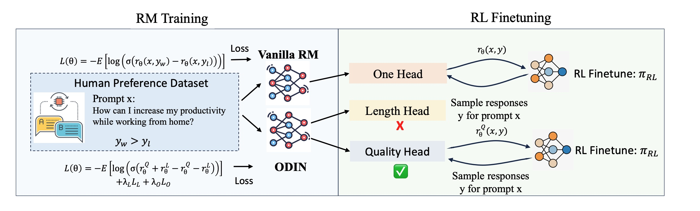

# The re-implementation of ODIN by using RLHFlow codebase

+ **Authors**

    [Lichang Chen*](https://lichang-chen.github.io/), [Chen Zhu*](https://scholar.google.com/citations?user=m-om5O8AAAAJ&hl=en), et al.

+ **Paper(ICML 2024)**: https://arxiv.org/abs/2402.07319 
+ **Model**: [Gemma-9B-ODIN](https://huggingface.co/Lichang-Chen/gemma_9b_odin_v2)
- **Code Repository:** https://github.com/RLHFlow/RLHF-Reward-Modeling/
+ **Architecture**

    <p align="center">
      
    </p>

## Usage
There is one simple use case in `serving_two_head.py`, where head 1 is the length head while head 2 is the quality head.


## Training
As the paper claimed, ODIN has three different losses:
+ Length loss: controlled by `args.correlation_with_length` in `gemma_two_head.py`
+ Othogonal loss: controlled by `args.otho_reg` in `gemma_two_head.py`
+ Ranking loss: the vanilla loss to train BT models 

Here is the script for training the ODIN:
```
export CUDA_VISIBLE_DEVICES=0,1,2,3,4,5,6,7

accelerate launch ./bradley-terry-rm/gemma_two_head.py --model_name google/gemma-2-9b-it \
    --max_length 2048 --train_set_path hendrydong/preference_700K --output_path ./gemma_9b_700K_v2 \
    --deepspeed ./deepspeed_configs/deepspeed_2.json --per_device_train_batch_size 16
```


## Citation

If you find this work useful for your research, please consider citing:
```
@article{chen2024odin,
  title={Odin: Disentangled reward mitigates hacking in rlhf},
  author={Chen, Lichang and Zhu, Chen and Soselia, Davit and Chen, Jiuhai and Zhou, Tianyi and Goldstein, Tom and Huang, Heng and Shoeybi, Mohammad and Catanzaro, Bryan},
  journal={arXiv preprint arXiv:2402.07319},
  year={2024}
}

```
